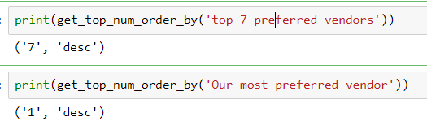
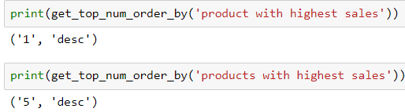
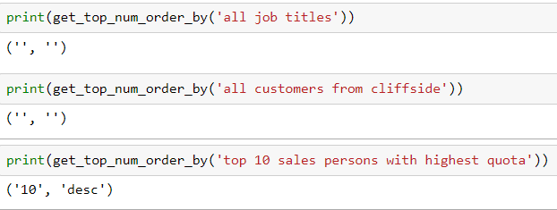

# text-to-mssql-query---top-and-order-by-clause
This repo is part of a larger project that attempts to convert a text query into a sql command. This repo attempts to identify:
1) How many rows the user query is expected to return
2) The sort-order of the query (ascending, descending or not specified)

As such, NLU (Natural Language Understanding), which deals with Machine Reading comprehension is considered an AI-complete problem. The problem however can be simplified by imposing certain constraints. The development of a Natural Language Interface such as this has several benifits:
1) Users are freed from the constraints of accessing data available in a set of pre-defined views
2) Systems can be designed and trained to recognize if, and what kind of visualizations most aptly describe the requested information. Such a development can potentially eliminate the need for designing a large number of fixed reports.

While there are a few implementations to translate Natural Language queries to syntactically valid database queries, I have found no system in place specifically for MS-SQL databases. 

This project (in-progress) attempts to convert text questions into mssql queries. The Adventureworks2012 database is used as the back-end database - https://msftdbprodsamples.codeplex.com/.

The general structure of a MS-SQL query is as below:

[SELECT {1} 2]

[FROM 3]

{WHERE 4}

{GROUP BY 5}

{HAVING 6}

{ORDER BY 7 8} 

where:

{1} - optional TOP clause to limit the number of results.

2   - list of columns to be returned

3   - table(s) to be queried along with the appropriate JOIN clauses

4   - optional filter condition(s)

5   - optional column to group by depending upon the user query

6   - optional filter for use with aggregate functions

7   - optional list of columns by which the result set needs to be sorted by

8   - optional clause indicating if the ordering is in ascending or descending order

As stated above, this repo parses the user text query to determine {1} and 8.
The function - get_top_num_order_by is defined. This accepts a text query and returns a tuple containing 1 and 8.

While the function still requires work, it is able to handle a number of cases

a) The function is currently completely general, and does not look for specific search terms:

b) The function is able to identify the number of rows the query expects:

If the function identifies that the user is interested in viewing multiple rows, but no top clause is identified, a configurable default  number of rows (currently 5) are returned.

c) The function is able to recognize cases where there is no explicit order by or top clause specified :

